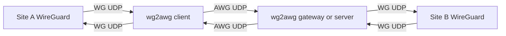
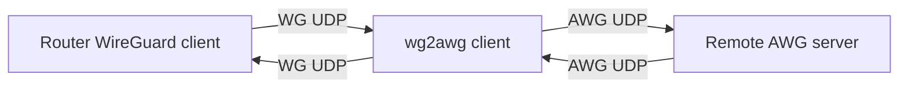
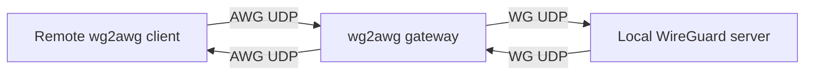
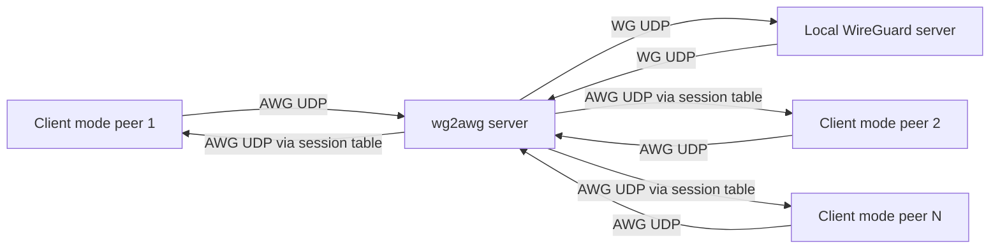

# wg2awg

`wg2awg` is a lightweight UDP proxy that converts packet format between
standard WireGuard and AmneziaWG.

It is designed for routers that already have a WireGuard client,
but need AmneziaWG-compatible packet framing
and obfuscation to reach remote AWG servers.

The proxy does not implement VPN encryption itself.
WireGuard encryption stays in WireGuard peers.
`wg2awg` only transforms packet type fields, padding,
and junk/CPS traffic patterns.

wg2awg is derived from amneziawg-mikrotik-c by timbrs:
<https://github.com/timbrs/amneziawg-mikrotik-c>

## Scope

* Runtime target: Linux.
* Transport: UDP over IPv4 and IPv6.
* Modes: `client`, `gateway`, `server`.
* Protocol profiles: AWG v1, v1.5, v2.

## What Problems It Solves

* Connect WireGuard-only routers to AmneziaWG servers.
* Build site-to-site flows with AWG framing on the public side.
* Aggregate multiple AWG clients into a single WireGuard backend in hub mode.

## Architecture

### End-to-End Topology (proxy on both sides)

This is the most universal layout when both edges run plain WireGuard stacks,
but the transport path between them must look like AWG traffic.



With this pattern you keep native WireGuard on both ends
and move AWG framing logic to dedicated proxy processes.

### Client Mode (`AWG_MODE=client`, default)

Use when your router has a local WireGuard client and a remote AWG server.



Client mode (`AWG_MODE=client`) is the WG -> AWG direction at egress
and AWG -> WG on return.
It is the standard client-side deployment when your local stack
is pure WireGuard and only the remote side expects AWG-framed packets.

### Gateway Mode (1:1, `AWG_MODE=gateway`)

Use when the remote side sends AWG and your local backend expects plain WG.



Gateway mode is the opposite mapping of client mode
for a single upstream backend.
It is commonly used on gateway/server side to terminate AWG-facing traffic
and feed a plain WireGuard service behind it.

### Server Mode (1:N, `AWG_MODE=server`)

Use when many AWG clients share one local WireGuard server.



Server mode extends gateway behavior with per-client session routing.
It tracks WireGuard sender/receiver indices and maps responses back to the
correct AWG client when multiple clients share one backend WG endpoint.

Notes:

* Server mode keeps a fixed session table (`4096` slots).
* Peer list limit for explicit server peers is `256`.
* Session routing uses WireGuard sender/receiver indices.

## Protocol Selection

Profile is selected automatically from effective settings:

* v2: any of `S3`, `S4`, or `H1..H4` ranges are used.
* v1.5: no v2 markers, but any `I1..I5` CPS template is set.
* v1: none of the above.

## Release Artifacts and Installation

[Latest release page](https://github.com/WoozyMasta/wg2awg/releases/latest).
Releases provide three artifact families per architecture:

* Static Linux binary: `wg2awg-<arch>`.
* OCI archive: `wg2awg-<arch>-oci.tar.gz`.
* Docker archive: `wg2awg-<arch>-docker.tar.gz`.

Container registries:

* GHCR: <https://github.com/WoozyMasta/wg2awg/pkgs/container/wg2awg>
* Docker Hub: <https://hub.docker.com/r/woozymasta/wg2awg/tags>

```bash
docker pull ghcr.io/woozymasta/wg2awg:latest
docker pull docker.io/woozymasta/wg2awg:latest
```

Architectures built by this repo (with practical hardware examples):

* `arm64`: modern 64-bit ARM routers, SBCs, and appliances.
  Typical families include MediaTek Filogic devices, Qualcomm IPQ60xx/IPQ80xx
  lines, and many newer OpenWrt-capable routers.
  RouterOS container-capable devices are commonly here as well.
* `arm`: 32-bit ARMv7 router and embedded families.
  Common on older ARM router lines and some RouterOS ARM boards.
* `armv5`: legacy ARMv5 targets.
  Mostly older low-power embedded and IoT-class Linux hardware.
* `amd64`: x86_64 systems.
  Mini PCs, NUC-class boxes, hypervisor/VM routers, and bare-metal servers.
  Also relevant for RouterOS x86/CHR container workflows.
* `mips`: big-endian MIPS targets (mostly legacy).
  Seen on older router and embedded network device families.
* `mipsel`: little-endian MIPS targets, still common in router fleets.
  Common SoC families include MediaTek, Broadcom, and Qualcomm/Atheros lines,
  depending on device generation and vendor.
  Typical vendor lines in OpenWrt target sets include TP-Link, D-Link,
  Keenetic, Zyxel, Linksys, Netgear, ASUS, and others.
* `mips64le`: 64-bit little-endian MIPS targets.
  Mostly niche embedded/industrial Linux systems.
* `ppc64le`: PowerPC 64-bit little-endian systems.
  Mostly industrial/server environments, uncommon for home routing.
* `386`: legacy 32-bit x86 systems.
  Older x86 routers, thin clients, and embedded PC-class hardware.

Notes:

* Device examples are indicative, not exhaustive.
* The actual artifact to use is determined by your runtime architecture
  (`uname -m`) and userland ABI.
* For model-level support, always verify by exact hardware revision
  in firmware compatibility databases.

Firmware ecosystem hints (for deployment planning):

* OpenWrt:
  Strong coverage across vendor lines and SoC targets;
  useful for TP-Link, D-Link, Zyxel, Keenetic, Netgear, Linksys, ASUS,
  and many ODM derivatives.
* RouterOS:
  Container package support is architecture-limited;
  practical container targets are primarily ARM/ARM64/x86.
* FreshTomato:
  Focused on Broadcom-based ARM and MIPS hardware families.

Practical usage:

* Use the binary on Linux hosts and Linux routers.
* Use OCI archives where your runtime imports OCI layout directly.
* Use Docker archives for runtimes/import flows
  that expect docker-archive layout.

Why two container archive formats:

* `oci.tar.gz` and `docker.tar.gz` contain the same application image,
  but in different archive layouts accepted by different import tools.
* Some container runtimes and RouterOS versions accept only one layout.
  If one format fails to import, use the other.

RouterOS guidance:

* RouterOS v7.18 and newer: prefer `oci.tar.gz` (native OCI import path).
* RouterOS before v7.18: use `docker.tar.gz` as compatibility fallback.
* On non-RouterOS platforms, prefer OCI first;
  use docker-archive only when your toolchain explicitly requires it.

When to use the raw binary:

* Use `wg2awg-<arch>` when you run directly on Linux without containers.
* Typical cases: OpenWrt/custom router firmware, systemd services,
  or minimal hosts where container runtime is unavailable or unnecessary.

## Configuration Model

### Sources and Priority

Effective config is merged in this order:

1. Built-in defaults.
1. Environment variables.
1. Config file values from `-c/--config` or `AWG_CONFIG`.
1. CLI log-level (`-l/--log-level`) over `AWG_LOG_LEVEL`.

Extra key precedence rules:

* `AWG_PRIVATE_KEY` derives `AWG_CLIENT_PUB`.
* If both are set, explicit `AWG_CLIENT_PUB` wins.
* If config file has `PrivateKey`, it overrides env-derived client key.

### Config File Support

Input format: WireGuard/AmneziaWG INI-style file.

`[Interface]` fields parsed:

* `PrivateKey` -> derives client public key.
* `ListenPort` -> converted to `0.0.0.0:<port>`.
* `DNS`.
* `Jc`, `Jmin`, `Jmax`,
  `S1`, `S2`, `S3`, `S4`,
  `H1`, `H2`, `H3`, `H4`,
  `I1`, `I2`, `I3`, `I4`, `I5`.

`[Peer]` fields parsed:

* `PublicKey`.
* `Endpoint`.

Behavior with multiple peers:

* First peer `PublicKey`/`Endpoint` populate main remote peer fields.
* All peer public keys are collected for server-mode peer matching.

Important parser nuance:

* Config file `H1..H4` support both single numeric values and `MIN-MAX` ranges.
* `ListenPort` from config still maps to `0.0.0.0:<port>` (IPv4 wildcard).

### CLI Flags

* `-c`, `--config <path>`: load config file.
* `-l`, `--log-level <none|error|info|debug>`.
* `-h`, `--help`.
* `-v`, `--version`.

### Parameter Mapping from WG/AWG Config

This proxy can consume a standard WireGuard/AmneziaWG INI file. Fields map to
runtime options as follows:

* `[Interface].PrivateKey` -> local client key, converted to client public key
  (same role as `AWG_PRIVATE_KEY`).
* `[Interface].ListenPort` -> `AWG_LISTEN` as `0.0.0.0:<port>`.
* `[Interface].DNS` -> resolver list written to `/etc/resolv.conf`.
* `[Interface].Jc/Jmin/Jmax/S1/S2/H1/H2/H3/H4` -> AWG obfuscation settings.
* First `[Peer].PublicKey` -> remote server key (`AWG_SERVER_PUB`).
* First `[Peer].Endpoint` -> `AWG_REMOTE`.
* All `[Peer].PublicKey` entries -> server-mode explicit peer list.

The config file has higher priority than environment variables.

### Environment Variables (Reference)

#### Core Routing and Mode

* `AWG_LISTEN`
  Local UDP socket where `wg2awg` accepts packets from its immediate peer.
  In `client`, this is usually the local WireGuard client endpoint.
  In `gateway/server`, this is the AWG-facing ingress port.
* `AWG_REMOTE`
  Upstream UDP destination used by the proxy.
  In `client`, it must point to the remote AWG server.
  In `gateway/server`, it must point to the local plain WireGuard backend.
* `AWG_MODE` (`client`, `gateway`, `server`; default `client`)
  Selects transformation direction and routing logic.
  `server` enables session-table based demultiplexing for many clients.
* `AWG_SRC_PORT` (`auto` or numeric; default `auto`)
  Source UDP port for the remote-facing socket.
  Numeric value binds a fixed source port.
  `auto` is dynamic in `client`: proxy tracks client source port and reconnects
  remote socket when client port changes, preserving NAT symmetry.

#### Identity, Keys, and Peer Resolution

* `AWG_SERVER_PUB`
  Base64 public key of the server-side WireGuard peer.
  Used to derive MAC1 key for handshake rewriting in the active direction.
* `AWG_CLIENT_PUB`
  Base64 public key of the client-side WireGuard peer.
  Used to derive MAC1 key for the opposite direction.
* `AWG_PRIVATE_KEY`
  Base64 private key (32 bytes) used only to derive `AWG_CLIENT_PUB`.
  If both are provided, explicit `AWG_CLIENT_PUB` overrides derived value.
* `AWG_CLIENT_PUBS`
  Comma/space/newline-separated client public keys for `server` mode.
  Used to resolve which client a WireGuard response belongs to.
* `AWG_CLIENT_PUBS_FILE`
  Same as `AWG_CLIENT_PUBS`, but read from file.
  Size is limited to 1 MiB; duplicate keys are ignored.
* `AWG_CONFIG`
  Path to INI config file. Equivalent to `-c`.

#### AWG Framing and Obfuscation Parameters

* `AWG_JC`
  Number of junk UDP packets sent before an outbound handshake-init.
  `0` disables junk pre-burst.
* `AWG_JMIN`, `AWG_JMAX`
  Min/max junk packet size in bytes.
  Junk sizes are randomized per packet in this range.
* `AWG_S1`
  Extra bytes prepended to WireGuard handshake-init packets.
  Applies only to type-1 handshake packets.
* `AWG_S2`
  Extra bytes prepended to WireGuard handshake-response packets.
  Applies only to type-2 handshake packets.
* `AWG_S3`
  Extra bytes prepended to WireGuard cookie-reply packets (v2 behavior).
  Applies only to type-3 packets.
* `AWG_S4`
  Extra bytes prepended to WireGuard transport-data packets (v2 behavior).
  Applies to data packets and changes transport packet length profile.
* `AWG_H1`, `AWG_H2`, `AWG_H3`, `AWG_H4`
  Replacement values for WireGuard message type field:
  `H1` -> handshake-init, `H2` -> handshake-response,
  `H3` -> cookie-reply, `H4` -> transport-data.
  Accepts either a fixed value (`123`) or range (`100-200`) in env and config.
  Ranges must not overlap after merge.
* `AWG_I1` .. `AWG_I5`
  CPS packet templates emitted before handshake-init.
  Supported segments in one template:
  `<b 0xHEX>` static bytes, `<r N>` random bytes, `<rc N>` random letters,
  `<rd N>` random digits, `<t>` unix timestamp (be32), `<c>` counter (be32).
  Example: `<b 0x48656c6c6f><r 8><t><c>`.

#### Proxy-to-Proxy Outer Obfuscation

`AWG_OBFS_PROFILE` option enables an additional external layer
of traffic obfuscation.

> [!NOTE]
> Works only in the `wg2awg <-> wg2awg` configuration;
> the same profile must be enabled on both sides.

* `off`: no outer wrapper, minimum overhead.
* `stun_ice`: STUN-like envelope with small size jitter.
* `dtls_record`: DTLS-record-like framing.
* `rtp_media`: RTP-like header with sequence/timestamp dynamics.
* `source_query`: Source-query-like prefix/frame.
* `raknet`: RakNet-like packet id + nonce frame.
* `quic_short`: QUIC-short-like header with variable DCID/PN/padding.
* `game_enet`: ENet-like command batch with variable command count.
* `game_kcp`: KCP-like segment fields with small pad jitter.
* `dns_like`: DNS-query-like header and qname envelope.

> [!IMPORTANT]
> This is not AmneziaWG framing and is incompatible
> with direct WireGuard/AmneziaWG nodes.

#### Reconnect and Runtime Behavior

* `AWG_TIMEOUT` (seconds, default `180`)
  Full inactivity timeout.
  If neither direction sees traffic for this interval, proxy reconnects remote
  socket (close + resolve + connect).
* `AWG_REMOTE_SILENT_TIMEOUT` (seconds, default `300`)
  One-sided silence timeout.
  If local client keeps sending but remote side stays silent for this interval,
  proxy forces reconnect. This is mainly useful for stale DNS/route recovery.
* `AWG_CONNECT_RETRIES` (default `0`)
  Startup-only connect retry count.
  `0` means unlimited retries before daemon enters steady state.
  After startup, runtime reconnect loop always retries with backoff.
* `AWG_DNS`
  Comma-separated resolvers written to `/etc/resolv.conf`.
  Affects hostname resolution for `AWG_REMOTE`.
  Config file `DNS` has precedence over env.

#### Socket and Performance Controls

* `AWG_SOCKET_BUF` (bytes, default `16777216`)
  Requested `SO_RCVBUF` and `SO_SNDBUF` for listen and remote sockets.
  Higher values reduce drop risk on bursty links at cost of RAM.
* `AWG_NO_GRO` (`0`/`1`, default `0`)
  Disables UDP GRO usage when set to `1`.
  With `0`, proxy tries GRO first and auto-falls back if GRO does not coalesce.
* `AWG_CPU_C2S`, `AWG_CPU_S2C` (default `-1`)
  Optional Linux thread affinity for c2s and s2c threads.
  `-1` keeps scheduler default behavior.
* `AWG_BUSY_POLL` (microseconds, default `0`)
  Enables `SO_BUSY_POLL` when positive.
  Can reduce latency under load, usually with higher CPU cost.

#### Logging

* `AWG_LOG_LEVEL` (`none`, `error`, `info`, `debug`; default `info`)
  Controls output verbosity.
  Parsing is first-letter based internally (`n/e/i/d`), so full words should
  be used for clarity.

## Validation Limits

The proxy enforces these hard checks (`config_validate`):

* `JC >= 0`.
* `JMIN >= 0`, `JMAX >= 0`, `JMAX < 65535`, `JMAX >= JMIN` when `JMAX > 0`.
* `S1` in `[0, 1352]`.
* `S2` in `[0, 1408]`.
* `S3` in `[0, 1436]`.
* `S4` in `[0, 1500]`.
* `H1..H4` ranges must not overlap.

From `amneziawg-linux-kernel-module` reference docs, practical ranges are:

* `JC`: usually `4..12`.
* `JMIN/JMAX`: small values (for example `8` and `80`) for low overhead.
* `S1/S2`: often `15..150`.
* `H1..H4`: unique values.

Treat these as operational guidance, not hard limits in this proxy.

## Deployment Examples

### Linux Host with Docker (client mode)

With env vars:

```bash
docker run --rm --network host \
  -e AWG_LISTEN=0.0.0.0:51820 \
  -e AWG_REMOTE=vpn.example.com:443 \
  -e AWG_SERVER_PUB='<server_pub_base64>' \
  -e AWG_CLIENT_PUB='<client_pub_base64>' \
  -e AWG_JC=7 -e AWG_JMIN=32 -e AWG_JMAX=324 \
  -e AWG_S1=0 -e AWG_S2=7 \
  -e AWG_H1=1250212372 -e AWG_H2=322115822 \
  -e AWG_H3=412530544 -e AWG_H4=654563364 \
  ghcr.io/woozymasta/wg2awg:latest
```

Config-file variant:

```bash
docker run --rm --network host \
  -v "$(pwd)/wg0.conf:/etc/wg2awg/wg0.conf:ro" \
  -e AWG_CONFIG=/etc/wg2awg/wg0.conf \
  ghcr.io/woozymasta/wg2awg:latest
```

### MikroTik RouterOS (client mode)

1. Enable container support and fetch:

   ```routeros
   /system/device-mode/update container=yes fetch=yes
   ```

1. Create veth + local container subnet + NAT:

   ```routeros
   /interface/veth/add name=veth-awg address=172.18.0.2/30 gateway=172.18.0.1
   /ip/address/add address=172.18.0.1/30 interface=veth-awg
   /ip/firewall/nat/add chain=srcnat action=masquerade src-address=172.18.0.0/30
   ```

1. Configure WireGuard peer endpoint to local proxy (`172.18.0.2:51820`).
1. Create container env list with AWG parameters from your exported `.conf`.
   Minimal example:

   ```routeros
   /container/envs/add list=wg2awg-env key=AWG_LISTEN value=0.0.0.0:51820
   /container/envs/add list=wg2awg-env key=AWG_REMOTE value=vpn.example.com:443
   /container/envs/add list=wg2awg-env key=AWG_MODE value=client
   ```

   Add the rest of required variables the same way
   (`AWG_SERVER_PUB`, `AWG_CLIENT_PUB`, and your AWG profile values).
1. Import and run image archive:

   ```routeros
   /container/add file=wg2awg-arm64-oci.tar.gz interface=veth-awg \
      envlist=wg2awg-env root-dir=disk1/wg2awg logging=yes
   /container/start [find where interface=veth-awg]
   ```

#### Config-file alternative, instead of many env vars

Mount a single config file and pass only `AWG_CONFIG` in env list.

```routeros
/container/envs/add list=wg2awg-env key=AWG_CONFIG value=/etc/wg2awg/wg0.conf
```

### OpenWrt / Linux Router Pattern

Use the same logical wiring as MikroTik:

* WireGuard peer endpoint points to local `wg2awg` listen socket.
* `wg2awg` remote points to real AWG server endpoint.

Example OpenWrt peer endpoint override:

```sh
uci set network.@wireguard_wg0[0].endpoint_host='127.0.0.1'
uci set network.@wireguard_wg0[0].endpoint_port='51820'
uci commit network
/etc/init.d/network restart
```

For Keenetic/Zyxel-class devices with WireGuard support,
apply the same pattern in CLI or Web UI:

* Local WG peer endpoint -> local proxy address and port.
* Proxy remote -> real AWG endpoint.
* Keep AWG obfuscation values identical on both ends.

## Verification and Operations

Basic checks:

* `wg2awg --version` prints expected release/build version.
* Handshake on WireGuard side updates.
* Proxy logs show client detection and remote connectivity.
* No recurring reconnect loop under stable network.

Useful knobs:

* `AWG_LOG_LEVEL=debug` for packet-path diagnostics.
* `AWG_NO_GRO=1` if your platform has GRO issues.
* `AWG_DNS` or config `DNS` when `AWG_REMOTE` is a hostname.

Common failure causes:

* AWG parameter mismatch (`J*`, `S*`, `H*`).
* Wrong public keys.
* Incorrect local endpoint wiring (WG peer not pointing to proxy).
* Time sync issues on routers (WireGuard is timestamp-sensitive).

## Build and Test from Source

Prerequisites:

* `gcc`, `make` (host tests/build).
* `clang-format`, `clang-tidy` (format and lint).
* Docker with buildx (containerized checks and cross-arch artifacts).

Recommended pre-push gate:

```bash
make container-check
make -j 8 container-test-matrix container-build-matrix
```

This runs:

* `container-check`: containerized full pre-push checks (glibc).
* `container-test-matrix`: runtime test matrix used by CI.
* `container-build-matrix`: full cross-arch artifact build matrix.

### Formatting and Linting

```bash
make fmt
make fmt-check
make lint
```

* `make fmt`: apply `clang-format` to `src/*.c` and `src/*.h`.
* `make fmt-check`: fail if code differs from `.clang-format`.
* `make lint`: run `clang-tidy` on runtime sources (`src/*.c`, non-test).

### Tests

#### Host-based test targets

```bash
make test
make test-hardening
make test-stress
make check-local
```

* `make test`: fast unit and component coverage.
* `make test-hardening`: fuzz-style parser/property checks,
  sanitizer runs (ASAN and UBSAN), and integration smoke scenarios.
* `make test-stress`: long/high-load networking behavior checks.
* `make check-local`: full local gate
  (`fmt-check` + `lint` + `test` + `test-hardening` + `test-stress`).

#### Containerized check target

Based on `Dockerfile.check`

```bash
make container-check-image
```

`make container-check-image`:
run checks in Debian-based check image with configurable scope.

Default scope:

* `fmt-check`
* `lint`
* `test`
* `test-hardening`
* `test-stress`

Useful knobs:

* `CONTAINER_LINT_TARGET` - any make target list passed as one string.

Example (disable stress):

```bash
make container-check-image CONTAINER_CHECK_TARGET="fmt-check lint test test-hardening"
```

#### Containerized test target

Based on `Dockerfile.test`

```bash
make container-test
make container-test CONTAINER_TEST_TARGET=test
```

* `make container-test`: run test container in muslcc image.
* `CONTAINER_TEST_TARGET` controls the make target inside test image
  (default: `test`).
* `Dockerfile.test` also verifies that `make build` succeeds and resulting
  `wg2awg` binary is statically linked.

#### Combined container checks

```bash
make container-check
```

* `make container-check`: run `container-check-image` (full glibc check profile).

### Matrix Tests (Multi-Architecture)

```bash
make container-test-matrix
make container-test-matrix CONTAINER_TEST_TARGET=test
make container-test-full-matrix
make container-test-matrix CONTAINER_TEST_ARCHS="amd64 arm64 arm mips mipsel"
```

* `make container-test-matrix`: run `Dockerfile.test` through buildx across
  `CONTAINER_TEST_ARCHS`.
* `CONTAINER_TEST_ARCHS` defaults to runtime-test set used in CI:
  `amd64 arm64 arm armv5`.
* `make container-test-full-matrix`: full architecture matrix (`ALL_ARCHS`).
* Use a reduced subset for faster pre-checks.

### Build

Native binary:

```bash
make build
```

Container artifacts:

```bash
make container-build-arm64
make container-build-matrix
```

* `make container-build-<arch>`:
  build binary + OCI + Docker archives for one arch.
* `make container-build-matrix`:
  build artifacts for all configured architectures.
* `build.sh` call format:
  `build.sh <platform> <arch-suffix> <muslcc-tag> [version] [build_dir]`.

## References

* [Historical idea reference](https://github.com/timbrs/amneziawg-mikrotik-c)
* [AmneziaWG Linux kernel module](https://github.com/amnezia-vpn/amneziawg-linux-kernel-module)
* [OpenWrt Table of Hardware](https://openwrt.org/toh/start)
* [OpenWrt downloads index](https://downloads.openwrt.org/)
* [MikroTik RouterOS container docs](https://help.mikrotik.com/docs/display/ROS/Container)
* [MikroTik RouterOS package architecture matrix](https://help.mikrotik.com/docs/spaces/ROS/pages/40992872/Packages)
* [MikroTik feature support by architecture](https://help.mikrotik.com/docs/spaces/ROS/pages/146440194/Feature%20support%20based%20on%20architecture)
* [FreshTomato project wiki](https://wiki.freshtomato.org/doku.php/start)
* [FreshTomato hardware compatibility](https://wiki.freshtomato.org/doku.php/hardware_compatibility)
* [Third-party notices](NOTICE)
